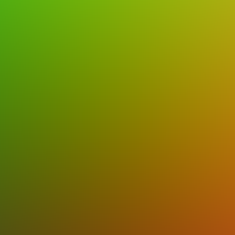
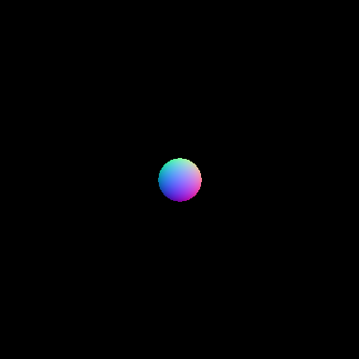
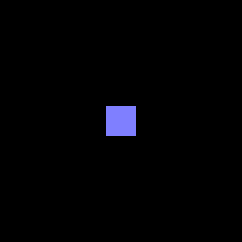
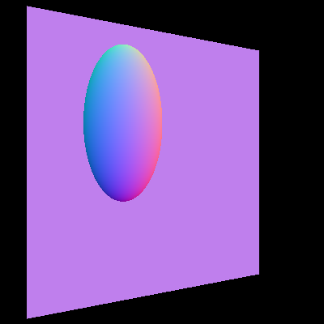

Ray Tracer Part I
======================

**University of Pennsylvania, CIS 561: Advanced Computer Graphics, Homework 1**

Overview
------------
You will implement a collection of classes and functions in order to create the
foundation of a ray tracer. You will begin by creating classes to represent
ray tracer architecture, such as a `Camera` and `Primitive`, then implement
functions to find the intersection of a ray with various surfaces.

Most importantly, you will write the vast majority of code yourself, following
the API we provide in the sections below. We have, however, provided you with
the following code:
* A linear algebra library called GLM
* A header file that provides a few GLM class aliases for code clarity

Creating a Qt Widgets Application
-----------------
Open Qt Creator and select New Project from the startup screen. Select
`Qt Widgets Application` from the list of options, name it whatever you want,
and keep the default class name as `MainWindow`. You should now have a basic Qt
GUI application that, when run, displays a blank main window GUI.

Open your `.pro` file in Qt Creator's text editor, and add the following line
of code: `CONFIG += c++11`. This will tell the compiler to recognize C++
features added in C++ in 2011. You should also add these two lines of code:

`INCLUDEPATH += $$PWD`

`DEPENDPATH += $$PWD`

These will make it so that you don't have to directly add GLM to your project's
list of files to compile, and so that its inclusion in `globalincludes.h`
compiles.

You should add a button or File menu option to your GUI that is connected to a
slot that will ultimately create a `QImage`, write color to each pixel in the
image, and save the `QImage` as a `.png` file with a `QFileDialog` prompt for
determining the file name and save location. For now, just set up the connection
between the button and the slot.

In order to build your ray tracing application from here, you will first create
the following classes:

`Ray` Class (8 points)
------------
Create a `Ray` class that stores an origin and a direction for itself. We
recommend using the `Point3f` and `Vector3f` aliases for the `vec3` class for
these member variables to make it clearer at a glance that they represent a point
and a direction individually.

Your `Ray` class should also implement a function that takes in a 4D
transformation matrix and returns a new `Ray` that is the result of transforming
this `Ray` by that transformation matrix. Note that you'll have to temporarily
convert your `Ray`'s origin and direction to `vec4`s for this to work. You'll
use this function when testing `Ray`s for intersection with geometry.

`Camera` Class (12 points)
-------------
Create a `Camera` class with a constructor that takes in the following data:
* An `eye` position
* A point in space at which its forward vector should point (i.e. a reference point)
* A "world up" vector
* A vertical field of view
* Near and far clipping plane values
* Screen width and height values

Using these attributes, the `Camera` should construct and store a view-projection
matrix along with the inverse of that view-projection matrix.

Additionally, your `Camera` class should implement a function called `rayCast`,
which should take in a pixel coordinate and return a `Ray` in world space that
corresponds to the input pixel.

Testing your ray casting code
------------
At this point, you can begin to implement `MainWindow`'s function that renders
your scene to a `QImage`. Create a `Camera` with the following attributes for
testing:
* `eye = (0, 0, 10)`
* `ref = (0, 0, 0)`
* `worldUp = (0, 1, 0)`
* `fieldOfView = 45`
* `width = height = 400`
* `nearClip = 0.1`
* `farClip = 1000`

For every pixel within your `Camera`'s screen width and screen height, cast a
ray and map the ray's normalized direction to a color with this formula:
`RGB = (ray.direction + vec3(1,1,1)) * 0.5f`. This maps the range `[-1, 1]` to
`[0, 1]` so that we can see negative directions as distinct colors. Store the
ray direction as a color in the pixel that spawned the ray, and if you do this
for all rays you should receive the following image as output:

If your output is different, consider the following common errors:
* Your camera's field of view is in degrees or radians when it should be the
opposite (depends on context, e.g. radians are correct when using FOV in a
tangent function)
* Your camera's width and height are represented as integers, so computing the
aspect ratio as width / height causes truncation of a `float` to an `int`
* You're incorrectly following the screen-to-world coordinate transformation
sequence. Perhaps you multiplied by the wrong `Uw`?

Once you've tested your ray casting, you can move on to implementing more
classes.

`Intersection` Class (10 points)
--------
This class will represent the set of information relevant to a point of
intersection between a `Ray` and a `Primitive` in the scene. It should store
the following member variables:
* `Point3f point`: The point on the surface (in world space) at which the
intersection occurred.
* `Normal3f normal`: The surface normal at the point of intersection in world
space.
* `float t`: The distance along the `Ray` at which this point of intersection
lies.
* `std::shared_ptr<const Primitive> objectHit`: A pointer to the `Primitive`
whose surface we are intersecting. We'll discuss the `Primitive` class below.

You will create temporary `Intersection`s in your code when you test `Ray`s to
find their points of intersection with the scene's geometry. For this assignment,
you will ultimately output the surface normal at an `Intersection` as the color
of the pixel that spawned the ray intersecting with the surface.

`Transform` Class (10 points)
-----------
A `Transform` will represent the sequence of transformations that have been
applied to a primitive in the scene in order to transform it to its current
location, size, and orientation. A `Transform` should store the following
members:
* A 3D vector to store its translational XYZ. You may wish to store this as a 3D vector.
* A 3D vector to store its scale in the XYZ directions.
* A 3D vector to represent its Euler angles of rotation, one float for each
rotational axis.
* A 4x4 matrix `worldTransform` which represents the following sequence of
transformations: `translate(tx,ty,tz) * rotate(rx, x_axis), * rotate(ry, y_axis) * rotate(rz, z_axis) * scale(sx, sy, sz)`. You should use GLM's built-in transformation functions to
more easily construct these individual matrices.
* A 4x4 matrix `worldTransformInverse` which represents the inverse of the world
transform matrix.
* A 3x3 matrix `worldTransformInverseTranspose`, which represents the transpose
of the inverse of the world matrix, after the world matrix has been truncated
to a 3x3 matrix to remove its translational component. This matrix will be used
to properly transform surface normals from local object space into world space
when finding the intersections of rays with geometry.

A `Transform` should implement two constructors:
* `Transform()`, which sets its translate and rotate to 0, and its scale to 1.
* `Transform(vec3 t, vec3 r, vec3 s)`, which takes in translate, rotate, and scale
values and sets up the `Transform`'s members accordingly.

You should also write any accessor functions you deem necessary. Remember your
const correctness!

`Primitive` Class and `Shape` Class (20 points)
--------
The `Primitive` class will be used to represent a construct that contains data
such as a shape, a material, and a light source. For this assignment, we will
only handle the `Shape` component of a `Primitive`. To this end, the `Primitive`
class should have the following member variables:
* A `QString` to represent its name, for debugging purposes
* A `std::shared_ptr` to a `Shape`, which will be used to store an intersectable
surface in the `Primitive`

The `Shape` class will be an abstract superclass for all intersectable surfaces,
such as spheres and planes. A `Shape` should have the following members:
* A `Transform` member variable to enable you to move the basic `Shape` around the scene and
alter its scale and orientation.
* A constructor that takes in a `Transform` to initialize the requisite member
variable
* A `virtual` destructor so that the class can properly act as a superclass!

Additionally, the `Primitive` class and the `Shape` class should declare the
following function: `bool getIntersection(Ray, Intersection*) const`.
Importantly, the `Shape` class should declare this function as being purely
virtual, whereas the `Primitive` class should implement it. The `Primitive`
implementation should have the following features:
* Returns whether or not an intersection with the `Primitive`'s `Shape`
occurred at all
* If there was an intersection, set the `Intersection`'s pointer to a `Primitive`
to `this`.

Importantly, the `Intersection` passed into this function will always be
declared on the stack, in a scope just outside the function call. You should
never initialize an `Intersection` on the heap; we pass it by pointer so that
we can modify it from within the function and effectively have two "return"
values: the actual return boolean, and the intersection information obtained if
the function returned `true`.

We will discuss the implementation of `getIntersection` for `Shape` subclasses
later in this document.

`Scene` Class (10 points)
---------
This class will be a container for all `Primitive`s in this assignment, and will
be expanded to contain things like light sources in future weeks. A `Scene`
should contain a `QList` of `std::shared_ptr`s to `Primitive`s as a member
variable. Additonally, for the sake of organization you may wish to store your
`Camera` in the `Scene` class as well.

The `Scene` class should implement its own version of
`bool getIntersection(Ray, Intersection*) const` which tests the
input `Ray` for intersection with all `Primitive`s in the `Scene` and outputs
the `Intersection` with the smallest non-negative `t` value via the
`Intersection*` input to the function. It should return `false` if the `Ray`
does not intersect any geometry.

`Sphere` and `SquarePlane` Classes (20 points)
---------
These two classes should inherit from the `Shape` class and should implement its
`getIntersection` function. A unit `Sphere` should be assumed to be centered at
the origin and have a radius of 0.5, and a unit `SquarePlane` should be centered
at the origin, have side lengths of 1, and have its normal aligned with the
Z-axis. Use this information to implement these classes' `getIntersection`
functions, making sure to transform the input `Ray` by the inverse of the
`Shape`'s world-space transformation matrix. `getIntersection` should modify the
input `Intersection` to contain a proper world-space point of intersection,
world-space surface normal, and t-value provided the `Ray` intersects the `Shape`.
Remember to properly transform the surface normal from local object space into
world space via the inverse-transpose model matrix.

Testing your intersection code
--------
Once you've implemented all of the functions defined above, you should be ready
to test your ray-object intersection engine. Begin by constructing a couple of
test scenes, one with an untransformed `Sphere` and one with an untransformed
`SquarePlane`. If you output the surface normal of the resulting `Intersection`
as a color, using the same direction-to-color formula as before, you should see
the following two images:

Once you've tested your basic object intersections, you can try rendering a
scene with transformed objects. Set up a scene with the following geometry:
* A `Sphere` with a translation of `(-1, 1, 0)`, no rotation, and a scale of `(2, 4, 2)`.
* A `SquarePlane` with a translation of `(0, 0, -5)`, a rotation of
`(0, 0, -30)`, and a scale of `(10, 10, 1)`.

You should receive this image:

Code Style (10 points)
------------
For the ray tracer assignments in this course, we will be grading you on coding
style since you'll be writing nearly all of the code yourself. We will be
following the style guide defined in CIS 560; you can find it [here](https://www.cis.upenn.edu/~cis460/17fa/styleguide.html) if you need to
review it. Part of this style guide is based on the design decisions made in
`Physically Based Rendering`, so adhering to it now will help you to better
understand PBRT's code once we begin the path tracer.

Submitting your project
--------------
Rather than uploading a zip file to Canvas, you will simply submit a link to
the committed version of your code you wish us to grade. If you click on the
__Commits__ tab of your repository on Github, you will be brought to a list of
commits you've made. Simply click on the one you wish for us to grade, then copy
and paste the URL of the page into the Canvas submission form.

At the top of this Markdown file, add a section titled "[Your Full Name Here]'s
Results" and show your test renders there. In addition to the tests for which
we provided example renders, upload the image you receive for rendering a scene
with these attributes:
* A `Sphere` with a translation of `(0, 0, 1)`, a rotation of `(0, 0, 45)`, and
a scale of `(2, 1, 1)`.
* A second `Sphere` with a translation of `(0, 0, 1)`, a rotation of
`(0, 0, 45)`, and a scale of `(2, 1, 1)`.
* A `SquarePlane` with a translation of `(0, -0.5, 0)`, a rotation of
`(90, 0, 0)`, and a scale of `(5, 5, 1)`.
